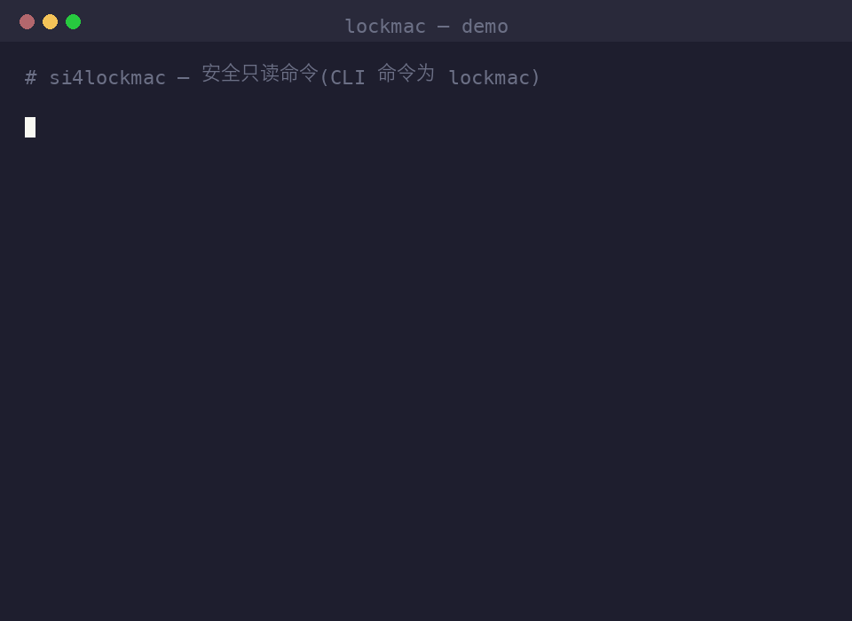
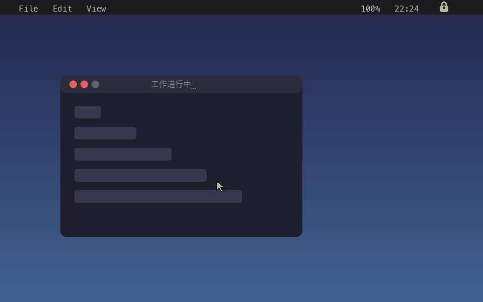

# si4lockmac

**English** · [中文](README.zh-CN.md) · [日本語](README.ja.md)

> Brand name: **si4lockmac**. The CLI command is `lockmac` (e.g. `lockmac veil`).

A **privacy veil for macOS**: black out every display with a top-most overlay so
onlookers can't see your screen — **without locking the Mac**. Remote control,
screenshots, and automation keep working behind it.

Standalone: pure Python stdlib + a tiny Swift overlay. No Telegram, no host
project required. (mob-remote integrates it for remote on/off, but si4lockmac
works entirely on its own.)



> A quick tour of the read-only CLI commands (`status`, `deadman`,
> `offline-lock`, `delete list`).

## What si4lockmac does for you

- 🕶️ **Instant privacy veil** — one command (or one tap) blacks out every display
  with a top-most overlay, so nobody around you sees your screen. You keep
  working: remote control, screenshots, and automation all run behind it.
- 🔒 **Real system lock on demand** — when you need true security, `lock` triggers
  the genuine macOS login window, locally or from your phone.
- 📱 **Remote control from Telegram** — veil, unlock, lock, or check status from
  anywhere, straight from a chat. No extra app, no server.
- ⏱️ **Dead-man switch** — if you stop responding or go offline, si4lockmac
  automatically veils, locks, or purges chosen folders. Works even with the
  network down.
- 🌐 **Offline-lock** — keep the Mac locked the whole time the network is
  unreachable, re-locking until you enter your password.
- 🔐 **Two-step verification (TOTP)** — add a 6-digit second factor to every
  unlock, with the secret backed up to your private channel.
- 🧹 **Emergency purge** — wipe a whitelist of sensitive folders on trigger, with
  hard guards against deleting `/`, `$HOME`, or system trees.

## Where it shines (use cases)

- **Cafés, co-working, airports** — step away from the keyboard and the screen
  goes black to onlookers instantly, while your downloads and renders keep going.
- **Open offices & shoulder-surfing** — hide sensitive work from anyone walking
  past, without the friction of locking and re-typing your password.
- **Presentations & screen sharing** — veil the desktop between demos without
  killing the session or your background tasks.
- **Travel & border crossings** — combine the dead-man switch and emergency purge
  so the machine self-protects if it leaves your control or you can't respond.
- **Remote / headless Macs** — drive lock and unlock entirely from Telegram, and
  let offline-lock guard a machine you can't be next to.

## Why "veil" not "lock"

- The overlay uses `CGShieldingWindowLevel` (above normal windows, covers the
  menu bar / Dock / all Spaces).
- `screencapture` and window-level grabs **bypass it** — so screenshots/remote
  tools still see the real content while onlookers see black.
- It is a **privacy screen, not a security lock**: Force-Quit, `ssh kill`, or a
  reboot all dismiss it. Good against shoulder-surfing, not a determined person
  at the keyboard.

## Guides

- **GUI / menu-bar (no terminal): [docs/usage/USAGE-gui.md](docs/usage/USAGE-gui.md)** — double-click installer, setup wizard, menu usage.
- **Command-line reference: [docs/usage/USAGE.md](docs/usage/USAGE.md)** — full CLI + Telegram.



> Menu-bar flow (illustration): click the 🔒 icon → pick **开启遮罩 / Veil** →
> the screen veils black with a password prompt.

## Install

**Homebrew (recommended):**

```bash
brew install --cask Well365/lockmac/lockmac
```

This downloads and installs the signed `.pkg`. Update later with
`brew upgrade --cask lockmac`; remove with `brew uninstall --cask lockmac`.

Prefer a manual install? Double-click `lockmac-0.5.0.pkg`, or see the other
options (one-line script, building from source) in
**[docs/usage/USAGE.md](docs/usage/USAGE.md)**.

## Quick start (3 steps)

```bash
# 1. Install (pick one — see below): pip / Homebrew / .pkg / one-line script
# 2. Set up (two commands)
lockmac setup            # set a password (required)
lockmac tg-setup         # bind a Telegram bot — a fresh bot can take 3-5 min (it polls)
# 3. Start all services in one go (also restarts if already running)
lockmac start            # veil-autostart + Telegram listener + hourly watchdog
lockmac status           # check each service
```

New to Telegram bots? See the illustrated 中/EN/日 guide:
**[docs/usage/telegram-bot-setup.html](docs/usage/telegram-bot-setup.html)**. Stop everything with `lockmac stop`.

## Use

Help: `lockmac --help` (terminal quick reference) · `lockmac help` (opens a
self-contained HTML page with 中 / English / 日本語 command docs).

Two levels of "lock":

| Command | Level | Remote-undo? |
|---|---|---|
| `veil` / `unveil` (= `on` / `off`) | app overlay — black out the screen, keep working | ✅ yes (password / Telegram) |
| `lock` | **real macOS system lock** (loginwindow) | ❌ no — one-way; needs the system password at the machine |

```bash
lockmac setup            # set a password + choose login autostart (installs LaunchAgent)
lockmac veil             # raise the privacy overlay (screen black; you keep working)
lockmac veil 30          # ...auto-dismiss after 30s (safety backstop)
lockmac unveil           # dismiss the overlay
lockmac lock             # REAL system lock + also raises the veil (double cover);
                         #   one-way; set LOCKMAC_LOCK_NO_VEIL=1 to skip the veil
lockmac status
lockmac passwd           # change password (verifies the current one first)
lockmac setup-2fa        # enable two-step (TOTP); unlock then needs password + 6-digit code
lockmac boot on|off      # toggle "veil on next login"
lockmac install-agent    # / uninstall-agent — manage login autostart
```

### Two-step verification (TOTP, optional)

`lockmac setup-2fa` prints a secret + `otpauth://` URI — add it to an
authenticator (Google Authenticator, 1Password, …). After that the second factor
is required **both** ways:
- **Local**: the overlay shows a password field **and** a 6-digit code field.
- **Telegram**: `/unveil <6-digit-code>` (your chat is the first factor, the code
  the second).

Same RFC 6238 algorithm on both sides, so any authenticator code works
everywhere. `lockmac 2fa-off` disables it.

If Telegram/iMessage is already set up, `setup-2fa` also **sends the secret to
that private channel as a backup**. ⚠️ **Back up the secret** — if you lose your
authenticator you can't dismiss the veil with the code; recover from a terminal
with `lockmac unveil` or `lockmac 2fa-off` (neither needs a code), so you're only
truly locked out with no terminal access on your only Mac.

## Three ways to dismiss (never get locked out)

1. **Local password** — type it into the on-screen field (salted SHA-256). Works
   with no network.
2. **SIGTERM** — `lockmac off`, or any integrator's remote "off".
3. **`--timeout` backstop** — `lockmac on N` auto-dismisses after N seconds.

Last resort: `ssh` in and `kill` the process.

## Telegram remote control (optional, self-contained)

si4lockmac can be driven from Telegram on its own — no other project needed:

Binding CRUD: `tg-setup` (create / re-run to change token) · `tg-info` (read,
masked token) · `tg-unbind` (delete + stop the listener).

```bash
lockmac tg-setup     # paste bot token, message the bot once → chat id auto-saved
lockmac tg-info      # show the current binding (token masked + chat id)
lockmac tg-unbind    # remove the binding and stop the listener + watchdog
lockmac tg-test      # send a test message
lockmac tg-listen    # long-poll in the foreground
lockmac tg-install   # …or install a KeepAlive LaunchAgent: tg-listen runs at
                     #   login and is restarted if it ever exits (tg-uninstall to remove).
                     #   Also installs an hourly watchdog that restarts the listener
                     #   (covers hangs KeepAlive can't catch). Opt out: --no-watchdog;
                     #   change cadence: --watchdog-interval <seconds>.
lockmac tg-restart   # restart the listener now (also what the watchdog runs)
```

- `/backend` — switch the lock backend (`self` | `si4locker`) from Telegram, with
  tap-to-switch buttons; or `/backend si4locker`. (CLI: `lockmac lock-backend …`.)

From your chat send `/veil`, `/unveil`, `/lock`, or `/status` (only the configured
chat id is honored, fail-closed):
- `/veil` / `/unveil` — raise / dismiss the removable overlay
- `/lock` — **real system lock** (one-way; you can lock remotely but must unlock
  at the machine with the system password)
- `/deadman <签到秒> <宽限秒> <lock|veil|delete> [失联秒]` — configure the dead-man
  timers from Telegram (no arg = show current). Takes effect **live** (tg-listen
  re-reads config each loop, no restart needed).
- `/delete add <path>` / `/delete list` / `/delete clear` — manage the delete list

> All dead-man times are configurable from **either** the CLI (`lockmac deadman …`)
> **or** Telegram (`/deadman …`) — they share the same config.

Use `tg-listen` for a foreground run, or `tg-install` to keep it always-on.

### Dead-man switch (auto-act if you don't respond / go offline)

`tg-listen` runs a local dead-man timer. **Two independent triggers** fire the
configured action (`lock` | `veil` | `delete`):

```bash
# deadman <check-in interval> <grace> <action> [offline-timeout]
lockmac deadman 1800 600 lock          # check-in every 30m, no tap in 10m → system lock
lockmac deadman 0 0 delete 3600         # no check-in; can't reach Telegram for 1h → purge dirs
lockmac deadman 1800 600 veil 7200     # check-in OR 2h offline → raise veil
lockmac deadman off                    # disable both triggers (keeps the action)
lockmac deadman                        # show current
```

- **Heartbeat trigger**: sends a **✅ 我在** button every interval; tap to reset.
  Miss the grace window → fire. (person AWOL while online)
- **Offline trigger**: can't reach Telegram for `offline-timeout` seconds → fire.
  Runs **locally**, so it works even with no network (device removed / powered off
  network). This is the true dead-man: the timer runs locally; only contact resets it.

Actions: `lock` = real system lock · `veil` = overlay · `delete` = remove the
configured directories.

### Offline-lock (stay locked while the network is down — requires a password)

A password is **mandatory**: lockmac refuses to raise a veil without one
(`lockmac setup`). On top of the dead-man, offline-lock keeps the machine locked
whenever the network is unreachable, until the password is entered:

```bash
lockmac offline-lock            # show (default ON: grace 60s / relock 300s)
lockmac offline-lock 60 300     # offline > 60s → lock; re-lock every 300s while offline
lockmac offline-lock off        # disable
```

- Offline past `grace` → **veil first, then the real system lock** (`system_lock`).
- While still offline it **re-locks every `relock` seconds** — even after you unlock,
  it locks again shortly (until the network returns). Re-arms when connectivity is back.
- Needs `tg-listen` running (online/offline is judged by reaching Telegram). Follows
  `lock-backend` (default `self`; or delegates to si4locker). Shown in `lockmac status`.

### Purge list (for `action=delete`)

```bash
lockmac delete add ~/Secret           # add a dir (rejects /, $HOME, system trees)
lockmac delete remove ~/Secret        # remove one entry (alias purge-rm / purge-del)
lockmac delete list
lockmac delete clear
lockmac delete now --dry-run          # 🧪 preview what WOULD be deleted (deletes nothing)
lockmac delete now --yes              # delete now (manual; --yes required)
```

⚠️ Irreversible (`rm -rf`). Test safely with `--dry-run` + a throwaway dir; see
the detailed guidance and a safe-test recipe in
**[docs/usage/USAGE.md](docs/usage/USAGE.md)** (§6).

⚠️ **Destructive.** Guards: paths must be absolute and are rejected if they are
`/`, `$HOME` itself, or any system tree (`/System`, `/Library`, `/usr`, …). Only
specific directories you add are ever deleted. For real whole-disk crypto-erase
you need MDM (`EraseDevice`) — that's a later, server-backed phase.

> One bot, one poller: getUpdates allows a single consumer per token. If
> something else already polls that bot (e.g. another relay), give lockmac its
> own bot — otherwise they conflict (Telegram 409).

MIT

---

## ❤️ Support the author / 打赏作者

This took a week and burned **500+ USD of tokens**. If si4lockmac helps you, please support its development.


- **DOGE**: `DJARW5ixK6sfMVGZvHiPNMMzo2Aoki13Cr` (Dogecoin network only — other assets are lost forever)
- **Email**: si4keyboard@gmail.com — priority feedback & custom features
- In Telegram: send `/donate` to get the QR and details.
