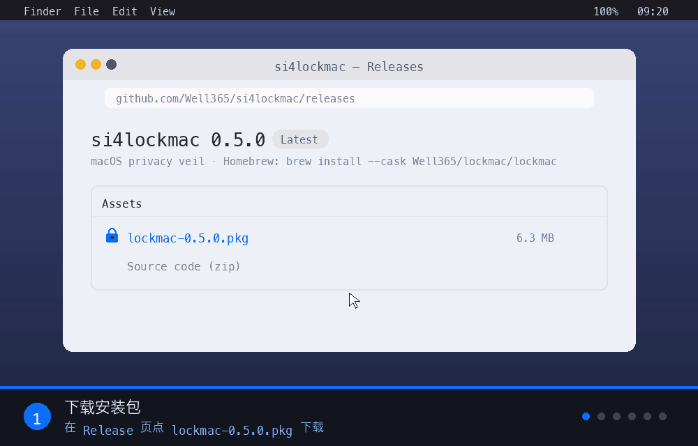
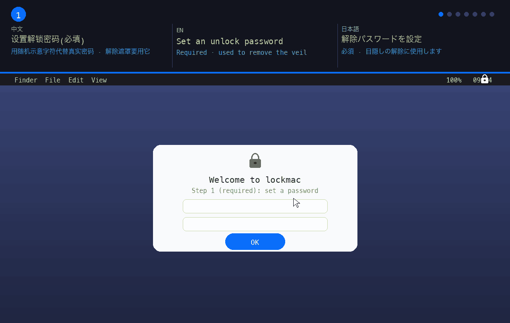

# si4lockmac

[English](README.md) · **中文** · [日本語](README.ja.md)

> 品牌名:**si4lockmac**。命令行命令仍是 `lockmac`(例如 `lockmac veil`)。

**macOS 隐私遮罩**:用一个置顶覆盖层把所有显示器盖黑,让旁人看不到你的屏幕——
**但不锁机**。遮罩背后,远程控制、截图、自动化照常工作。


自包含:纯 Python 标准库 + 一个很小的 Swift 遮罩。不依赖 Telegram、不依赖任何宿主项目。
(mob-remote 可集成它做远程开关,但 si4lockmac 完全能独立运行。)


> 字幕中英日三语。只读命令快速一览(`status`、`deadman`、`offline-lock`、`delete list`)。

> 教程:**[图形界面版 → docs/usage/USAGE-gui.md](docs/usage/USAGE-gui.md)**(免终端)· **[命令行版 → docs/usage/USAGE.md](docs/usage/USAGE.md)**。


> 字幕中英日三语。菜单栏操作(示意图):点顶部 🔒 图标 → 选「开启遮罩」→ 屏幕变黑并弹出密码框。

## si4lockmac 能为你做什么

- 🕶️ **一键隐私遮罩** —— 一条命令(或一次点击)把所有显示器盖黑,旁人看不到你的
  屏幕。而你照常工作:遮罩背后远程控制、截图、自动化全部继续运行。
- 🔒 **需要时上真锁** —— 真要安全时,`lock` 触发 macOS 真·登录窗口,本地或手机都能锁。
- 📱 **Telegram 远程控制** —— 随时随地从对话里遮罩、解除、上锁、查状态。不用额外
  App,不用服务器。
- ⏱️ **定时开关(死人开关)** —— 你不应答或失联时,自动遮罩、上锁或清除指定目录。
  断网也照样生效。
- 🌐 **离线锁** —— 只要网络不可达就一直锁住,直到你输入密码,期间反复重锁。
- 🔐 **两步验证(TOTP)** —— 给每次解除加一道 6 位码,密钥还会备份到你的私有频道。
- 🧹 **紧急清除** —— 触发时按白名单清空敏感目录,并对 `/`、`$HOME`、系统树设硬护栏。

## 应用场景

- **咖啡馆、共享办公、机场** —— 离开键盘瞬间对旁人变黑屏,而你的下载、渲染照常进行。
- **开放办公区、防肩窥** —— 不必锁机重输密码,就能挡住路过的人偷看敏感内容。
- **演示与投屏** —— 在两段演示之间盖黑桌面,既不中断会话也不打断后台任务。
- **出行与过关** —— 配合死人开关 + 紧急清除,设备一旦脱离掌控或你无法应答即自我保护。
- **远程 / 无人值守 Mac** —— 完全用 Telegram 远程上锁解锁,离线锁守护你不在身边的机器。

## 为什么叫「遮罩」不是「锁」

- 覆盖层用 `CGShieldingWindowLevel`(在普通窗口之上,盖住菜单栏 / Dock / 所有 Spaces)。
- `screencapture` 和窗口级抓屏**能绕过它**——所以截图/远程工具仍看到真实内容,旁人看到的是黑屏。
- 它是**隐私屏,不是安全锁**:Force-Quit、`ssh kill`、重启都能消除它。防肩窥有效,
  不防一个铁了心坐在键盘前的人。要真正安全请用系统真锁(`lock`)。

## 安装

**Homebrew(推荐):**

```bash
brew install --cask Well365/lockmac/lockmac
```

它会自动下载并安装已签名的 `.pkg`。之后更新用 `brew upgrade --cask lockmac`;卸载用 `brew uninstall --cask lockmac`。

想手动安装?双击 `lockmac-0.5.0.pkg`,或查看其它方式(一键脚本、从源码构建)见 **[docs/usage/USAGE.md](docs/usage/USAGE.md)**。



> 字幕中英日三语。手动 `.pkg` 安装(示意图):下载 → 提示「未打开」→ 系统设置 ▸ **仍要打开** → 输 Mac 密码 → 安装向导 → 完成。画面数据全为假。

帮助:`lockmac --help`(终端快速版) · `lockmac help`(打开自包含 HTML 页,中 / English / 日本語 命令说明)。
其它安装方式(Homebrew / .pkg / 一键脚本)、未签名 .pkg 如何安装/签名、如何更新旧版本,见 **[docs/usage/USAGE.md](docs/usage/USAGE.md)**。

## 快速开始（三步）

```bash
# 1. 安装(任选一种,见下):pip / Homebrew / .pkg / 一键脚本
# 2. 设置(两条命令)
lockmac setup            # 设密码(必须)
lockmac tg-setup         # 绑定 Telegram bot —— 新建的 bot 常要 3-5 分钟(会自动轮询)
# 3. 一键启动全部服务(已运行则重启)
lockmac start            # 遮罩自启 + Telegram 监听 + 每小时 watchdog
lockmac status           # 查看各服务状态
```

不懂怎么弄 Telegram bot?看图文中/英/日教程:**[docs/usage/telegram-bot-setup.html](docs/usage/telegram-bot-setup.html)**。全部停止:`lockmac stop`。



> 字幕中英日三语。菜单栏设置向导(示意图):设密码 → 绑定 Telegram → 给 bot 发消息 → 绑定 iMessage → 开启 2FA → 服务全部启动 → 遮罩界面。所有 token / Apple ID / 2FA 密钥均为随机假值。

## 使用

两级「锁」:

| 命令 | 级别 | 可远程解除? |
|---|---|---|
| `veil` / `unveil`(= `on` / `off`) | App 覆盖层——盖黑屏幕,后台照常工作 | ✅ 可(密码 / Telegram) |
| `lock` | **真·macOS 系统锁**(登录窗口) | ❌ 不可——单向;需到机器前输系统密码 |

```bash
lockmac setup            # 设密码(必须)+ 开机自启
lockmac veil             # 开遮罩
lockmac unveil           # 解除(输密码)
lockmac status           # 查看状态
```

> **必须设密码**:lockmac 不允许无密码遮罩(`lockmac on` 会被拒绝)。

### 两步验证(TOTP,可选)

```bash
lockmac setup-2fa        # 出示密钥/二维码,加进 Authenticator(已绑 TG/iMessage 会把密钥备份发过去)
```
启用后:本地解除 = 密码 + 6 位码;Telegram 解除 = `/unveil`(会提示回复 6 位码)。
⚠️ **务必备份密钥**:丢失验证器后遮罩界面无法用码解除;自救 = 终端 `lockmac unveil` 或 `lockmac 2fa-off`(都不需要码),仅当「无终端 + 唯一设备」才会真锁死。

### Telegram 远程控制(可选,自包含)

绑定的增删改查:`tg-setup`(增/改 token)· `tg-info`(查,token 打码)· `tg-unbind`(删 + 停监听)。

```bash
lockmac tg-setup     # 粘贴 bot token,给 bot 发条消息 → 自动存 chat id
lockmac tg-info      # 查:看当前绑定(token 打码 + chat id)
lockmac tg-unbind    # 删:解绑并停掉监听+watchdog
lockmac tg-test      # 发测试消息
lockmac tg-listen    # 前台跑监听
lockmac tg-install   # 或装成 LaunchAgent 常驻服务(KeepAlive + 每小时 watchdog)
```

在对话里发 `/veil` `/unveil` `/lock` `/status`(只响应绑定的 chat,fail-closed):
- `/backend` — 切换锁屏后端(`self` / `si4locker`),带按钮一键切
- `/deadman <签到秒> <宽限秒> <lock|veil|delete> [失联秒]` — 配置定时开关(即时生效)
- `/delete add <路径>` / `/delete list` / `/delete clear` — 管理删除清单

### 定时开关(无响应 / 失联自动执行)

```bash
lockmac deadman 1800 600 lock   # 每 30min 签到,10min 不点 → 系统锁
lockmac deadman 0 0 delete 3600  # 不签到;连不上 TG 满 1h → 删目录
lockmac deadman off             # 关闭两个触发(动作保留)
lockmac deadman                 # 查看当前配置
```
- **心跳触发**:每隔 interval 发「✅ 我在」按钮;宽限内不点 → 触发(人在线但无应答)。
- **失联触发**:连不上 Telegram 满 N 秒 → 触发。**本地运行**,断网也生效(设备被带离/关网)。

### 离线锁(断网就一直锁,直到输入密码)

```bash
lockmac offline-lock            # 查看(默认开:grace 60s / relock 300s)
lockmac offline-lock 60 300     # 断网 > 60s → 锁;仍断网每 300s 重锁
lockmac offline-lock off        # 关闭
```
- 断网超过 `grace` → **先升遮罩,再触发系统真锁**。
- 仍断网则**每隔 `relock` 秒重锁一次**——即使你输密码解开,过一会儿(只要还断网)又会锁;联网即解除武装。
- 需 `tg-listen` 在跑(靠能否连上 Telegram 判断在线/离线)。跟随 `lock-backend`。`lockmac status` 可见。

### 删除清单(`action=delete` 用)

```bash
lockmac delete add ~/机密             # 加目录(拒绝 /、$HOME、系统树)
lockmac delete remove ~/机密          # 删:移除一条(别名 purge-rm/purge-del)
lockmac delete list
lockmac delete clear
lockmac delete now --yes             # 立即删除(手动;需 --yes)
lockmac delete now --dry-run         # 🧪 预览将删什么(不真删)
```

⚠️ 不可逆(`rm -rf`)。先用 `--dry-run` + 一次性目录安全测试;详细说明与设置建议见 **[docs/usage/USAGE.md](docs/usage/USAGE.md)**(§6)。

⚠️ **有破坏性。** 护栏:必须绝对路径;`/`、`$HOME` 本身、系统树(`/System` `/Library` `/usr` …)一律拒绝。
只删你显式加入的目录。整盘加密擦除需要 MDM(`EraseDevice`),属后续服务端阶段。

> 一个 bot 一个 poller:getUpdates 同一 token 只允许一个消费者。若已有别的程序在轮询该 bot,
> 给 lockmac 单独建一个 bot——否则会冲突(Telegram 409)。

MIT

---

## ❤️ 打赏作者 / Support

本项目耗时一星期,燃烧了**价值超过 500 美金的 token**。如果 si4lockmac 帮到你,欢迎支持作者继续开发。


- **DOGE**:`DJARW5ixK6sfMVGZvHiPNMMzo2Aoki13Cr`(仅发 Dogecoin 网络资产,其他资产将永远丢失)
- **邮件**:si4keyboard@gmail.com —— 优先提交反馈、定制专属功能
- Telegram 里发 `/donate` 获取二维码与详情。
